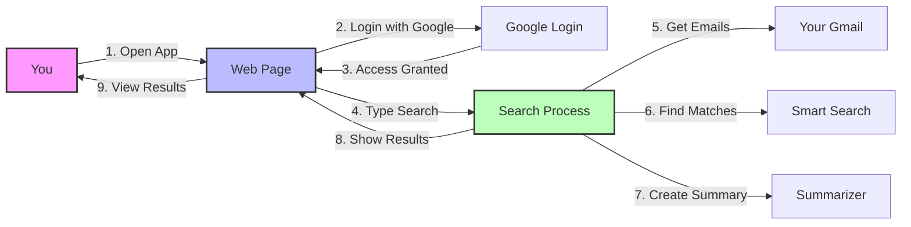

# Gmail RAG Application - Simplified Architecture

## What This App Does
This application helps you search through your Gmail emails using natural language and get smart summaries of relevant emails. Think of it like having a smart assistant that can understand what you're looking for in your emails.

## Simple Flow Diagram

## How It Works - Step by Step

1. **Starting Point**
   - You open the web application
   - You log in with your Google account
   - The app gets permission to read your emails

2. **Search Process**
   - You type what you're looking for (like "meeting notes from last week")
   - You pick a date range to search in
   - The app starts searching

3. **Behind the Scenes**
   - The app looks through your emails in the chosen date range
   - It uses AI to understand what you're looking for
   - It finds the most relevant emails
   - It creates short summaries of the important parts

4. **Results**
   - You see a list of matching emails
   - Each email shows:
     - Subject
     - Sender
     - Date
     - A short summary of what it's about

## Main Parts of the App

1. **Frontend (What You See)**
   - The web page you interact with
   - Search box and date picker
   - Results display

2. **Backend (What You Don't See)**
   - Email fetcher (gets your emails)
   - Smart search (finds relevant emails)
   - Summarizer (creates short summaries)

## Security
- Your Google account is used for secure login
- The app only reads your emails (can't send or delete)
- Your data stays private

## What You Need to Use It
- A Google account
- A web browser
- Internet connection

## The Power of Vector Databases

### What are Vector Databases?
- Think of them as smart storage systems that understand the meaning of text
- Instead of just storing words, they store the "meaning" of text as numbers (vectors)
- This helps find similar content even when the exact words don't match

### Why They're Important in This App
1. **Smart Search**
   - Regular search: Only finds exact word matches
   - Vector search: Finds emails with similar meaning
   - Example: Searching for "meeting notes" will also find "discussion summary" or "conference minutes"

2. **How It Works in Our App**
   - When you type a search query:
     1. Your search is converted into a vector (a set of numbers representing meaning)
     2. Each email in your inbox is also converted into vectors
     3. The system compares these vectors to find the most similar matches
     4. This is much smarter than traditional keyword search

3. **Benefits**
   - More accurate results
   - Finds relevant emails even with different wording
   - Understands context and meaning
   - Faster than reading through all emails

### Technical Implementation
- Uses FAISS (Facebook AI Similarity Search)
- Efficiently handles large numbers of emails
- Quick response times even with big email accounts
- Optimized for semantic similarity search 