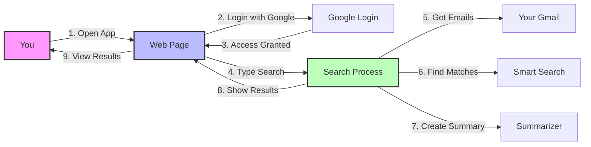

# Gmail RAG Application - Simplified Architecture

## What This App Does
This application helps you search through your Gmail emails using natural language and get smart summaries of relevant emails. Think of it like having a smart assistant that can understand what you're looking for in your emails.

## Simple Flow Diagram

## How It Works - Step by Step

1. **Starting Point**
   - You open the web application
   - You log in with your Google account
   - The app gets permission to read your emails

2. **Search Process**
   - You type what you're looking for (like "meeting notes from last week")
   - You pick a date range to search in
   - The app starts searching

3. **Behind the Scenes**
   - The app looks through your emails in the chosen date range
   - It uses AI to understand what you're looking for
   - It finds the most relevant emails
   - It creates short summaries of the important parts

4. **Results**
   - You see a list of matching emails
   - Each email shows:
     - Subject
     - Sender
     - Date
     - A short summary of what it's about

## Main Parts of the App

1. **Frontend (What You See)**
   - The web page you interact with
   - Search box and date picker
   - Results display

2. **Backend (What You Don't See)**
   - Email fetcher (gets your emails)
   - Smart search (finds relevant emails)
   - Summarizer (creates short summaries)

## Security
- Your Google account is used for secure login
- The app only reads your emails (can't send or delete)
- Your data stays private

## What You Need to Use It
- A Google account
- A web browser
- Internet connection 