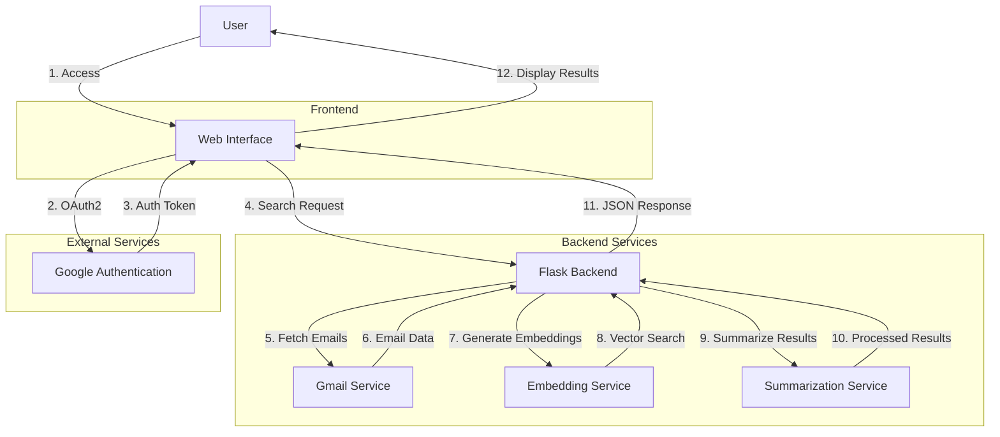

# Gmail RAG Application Architecture

## System Overview

The Gmail RAG (Retrieval-Augmented Generation) application is a Flask-based web application that enables semantic search and summarization of Gmail contents. The system uses modern AI techniques including embeddings and natural language processing to provide intelligent email search capabilities.

## Architecture Flow

## Component Details

### 1. Frontend Components
- **Web Interface (`templates/index.html`, `static/js/app.js`, `static/css/styles.css`)**
  - Modern, responsive UI built with HTML, CSS, and JavaScript
  - Date range selection with Flatpickr integration
  - Real-time search results display
  - Loading state management

### 2. Backend Components
- **Flask Application (`app.py`)**
  - Main application server
  - Route handling and request processing
  - Session management
  - Error handling and logging

- **Gmail Service (`gmail_service.py`)**
  - Gmail API integration
  - Email fetching and processing
  - Authentication handling
  - Email content extraction

- **Embedding Service (`embedding_service.py`)**
  - Text embedding generation
  - Vector similarity search
  - FAISS integration for efficient search

- **Summarization Service (`summarization_service.py`)**
  - Email content summarization
  - Natural language processing
  - Result formatting

### 3. Authentication Flow
1. User accesses the application
2. OAuth2 authentication with Google
3. Token management and refresh
4. Secure session handling

### 4. Search Flow
1. User submits search query with date range
2. Backend fetches relevant emails
3. Generates embeddings for query and emails
4. Performs vector similarity search
5. Summarizes matching emails
6. Returns formatted results

## Data Flow

1. **Input Processing**
   - User query and date range parameters
   - OAuth2 credentials
   - Email content

2. **Processing Pipeline**
   - Email retrieval
   - Text embedding generation
   - Vector similarity search
   - Content summarization

3. **Output Generation**
   - JSON response with summarized results
   - Error handling and status messages
   - Loading states

## Security Considerations

- OAuth2 authentication flow
- Secure session management
- Environment variable configuration
- SSL/TLS encryption
- API key management

## Dependencies

- Flask (Web Framework)
- Google API Client Library
- FAISS (Vector Search)
- Natural Language Processing Libraries
- Frontend Libraries (Flatpickr)

## Configuration

- Environment variables (.env)
- Google Cloud Console setup
- OAuth2 credentials
- API endpoints configuration 