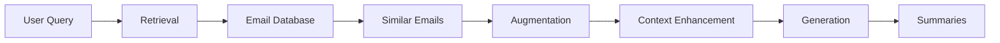

# Gmail Search Assistant

A smart email search application that helps you find and understand your Gmail emails using natural language processing and AI. This application uses Retrieval-Augmented Generation (RAG) to provide intelligent search and summarization capabilities.

YT link demo: https://www.youtube.com/watch?v=9WFf97pvE4I

Workflow : Checkout workflow.md

## Features

- 🔍 Natural language search for emails
- 📅 Flexible date range filtering
- 📝 Optional email summarization
- ⚡ Fast search with FAISS
- 🔒 Secure Gmail authentication
- 💾 Efficient caching system

## How It Works

### 1. Getting Started
- Open the web application
- Log in with your Google account
- Allow the app to access your Gmail

### 2. Search Options
- Type what you're looking for in natural language
- Choose your preferences:
  - Turn summarization on/off
  - Pick fast or precise search
  - Select number of results (3-50)
  - Toggle new email fetching

### 3. Behind the Scenes
- The app understands your search query
- Finds similar emails in your inbox
- Creates summaries if requested
- Prepares the results

### 4. View Results
- See a list of matching emails
- Read the summaries (if enabled)
- Click to view the full email

## Technical Overview

### Core Components

1. **Frontend**
   - Modern UI with Bootstrap
   - Responsive design
   - User-friendly search interface
   - Real-time feedback

2. **Backend**
   - Flask web framework
   - Gmail API integration
   - OAuth2 authentication
   - Session management

3. **Search Engine**
   - Vector-based similarity search
   - FAISS for fast retrieval
   - Cosine similarity as fallback
   - Configurable result count

4. **Summarization**
   - CPU-optimized models
   - Parallel processing
   - Efficient chunking
   - Smart caching

### Data Flow



## Setup Guide

1. Clone the repository
2. Install dependencies:
   ```bash
   pip install -r requirements.txt
   ```
3. Set up Gmail API credentials:
   - Go to Google Cloud Console
   - Create a new project
   - Enable Gmail API
   - Create OAuth 2.0 credentials
   - Download and save as `credentials.json`

4. Run the application:
   ```bash
   python app.py
   ```

5. Open your browser and visit:
   ```
   http://localhost:5000
   ```

## Project Structure

```
├── app.py                 # Main Flask application
├── gmail_service.py       # Gmail API integration
├── embedding_service.py   # Text embedding and search
├── summarization_service.py # Email summarization
├── utils.py              # Utility functions
├── templates/            # Frontend templates
│   ├── base.html        # Base template
│   └── index.html       # Search interface
└── cache/               # Cached data
    ├── embeddings/      # Email embeddings
    ├── faiss/          # Search index
    ├── summaries/      # Email summaries
    └── emails.db       # Email database
```

## Example Usage

1. **Search Queries:**
   - "Find emails about project meeting last week"
   - "Show me invoices from March"
   - "Where are the meeting notes from yesterday?"

2. **What You'll See:**
   - List of relevant emails
   - Who sent them
   - When they were sent
   - What they're about (summary)

3. **Tips for Best Results:**
   - Use natural language
   - Be specific about what you want
   - Use date ranges to narrow results
   - Enable summarization for quick overview


## Requirements

- Python 3.8+
- Flask
- Google API Client
- sentence-transformers
- FAISS
- PyTorch
- Other dependencies in requirements.txt

## Security

- Uses OAuth2 for Gmail authentication
- Stores data locally only
- Implements proper session management
- Includes input validation
