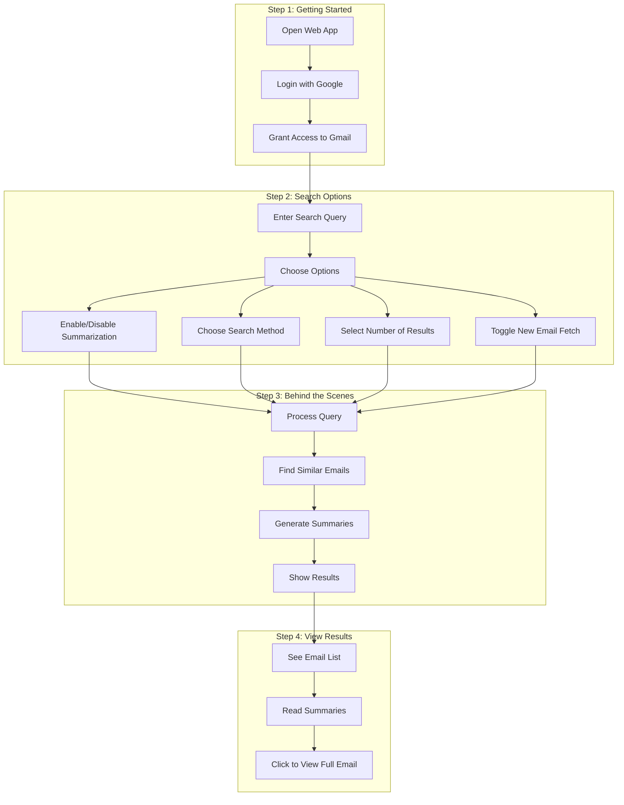

# Gmail Search Assistant - Simple Workflow

## How It Works

## Simple Explanation

### 1. Getting Started
- Open the web application
- Log in with your Google account
- Allow the app to access your Gmail

### 2. Search Options
- Type what you're looking for in natural language
- Choose your preferences:
  - Turn summarization on/off
  - Pick fast or precise search
  - Select how many results to show
  - Decide whether to fetch new emails

### 3. Behind the Scenes
- The app understands your search query
- Finds similar emails in your inbox
- Creates summaries if requested
- Prepares the results

### 4. View Results
- See a list of matching emails
- Read the summaries (if enabled)
- Click to view the full email

## Example Search

1. **What to Type:**
   - "Find emails about project meeting last week"
   - "Show me invoices from March"
   - "Where are the meeting notes from yesterday?"

2. **What You'll See:**
   - List of relevant emails
   - Who sent them
   - When they were sent
   - What they're about (summary)

3. **What You Can Do:**
   - Read the summaries
   - Click to open full emails
   - Try different search options
   - Get new results instantly

## Tips for Best Results

1. **Use Natural Language**
   - Type like you're talking to someone
   - Don't worry about exact words
   - Be specific about what you want

2. **Choose the Right Options**
   - Enable summarization for quick overview
   - Use fast search for quick results
   - Fetch new emails when needed

3. **Try Different Searches**
   - Start with simple queries
   - Add more details if needed
   - Use date ranges to narrow results 