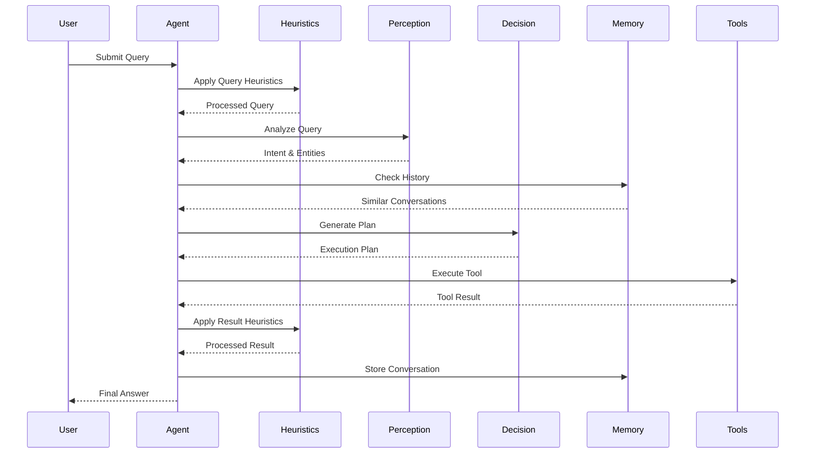

# Cortex-R Agent

A sophisticated AI agent system that combines multiple capabilities including natural language processing, mathematical
computation, document handling, and web search functionality.

## 🚀 Features

- **Query Processing**
    - Natural language understanding
    - Intent recognition
    - Entity extraction
    - Tool selection

- **Heuristics System**
    - Banned words removal
    - Whitespace normalization
    - Query length optimization
    - Special characters handling
    - Case normalization
    - Punctuation standardization
    - Duplicate word removal
    - Number normalization
    - Result relevance checking

- **Conversation Management**
    - Historical conversation indexing
    - Similar conversation search
    - Session management
    - Conversation persistence

- **Tool Integration**
    - Mathematical operations
    - Document processing
    - Web search capabilities
    - Python sandbox execution

## 🏗 Architecture

### Core Components

1. **Agent Loop** (`core/loop.py`)
    - Main execution loop
    - Step management
    - Error handling
    - Retry logic

2. **Perception Module** (`modules/perception.py`)
    - Query analysis
    - Intent detection
    - Entity extraction
    - Tool selection

3. **Decision Module** (`modules/decision.py`)
    - Plan generation
    - Tool selection
    - Execution strategy

4. **Memory System** (`modules/memory.py`)
    - Session management
    - Conversation storage
    - Tool result caching

5. **Conversation Index** (`modules/conversation_index.py`)
    - FAISS-based similarity search
    - Conversation embedding
    - Historical context

### MCP Servers

1. **Math Server** (`mcp_server_1.py`)
    - Basic arithmetic
    - Special conversions
    - Python sandbox

2. **Document Server** (`mcp_server_2.py`)
    - PDF processing
    - Webpage extraction
    - Document search

3. **Web Search Server** (`mcp_server_3.py`)
    - DuckDuckGo integration
    - Web content fetching
    - Search result processing

## 🔄 Workflow



## 📊 Example Logs

### Query 1: Simple Interest Calculation

```
🧑 Query: Ravi deposits ₹5,000 in a bank at a simple interest rate of 6% per annum.
What will be the interest earned after 2 years?

[22:35:48] [heuristics] Applied heuristics: special_characters_removal, case_normalization, 
duplicate_words_removal, number_normalization, low_relevance_warning
[22:35:49] [memory] Found 5 similar past conversations
[22:35:51] [perception] Intent: Calculate simple interest
[22:35:53] [plan] Generated execution plan
[22:35:58] [action] Executed calculation
💡 Final Answer: 600.0
```

### Query 2: Square Root Calculation

```
🧑 Query: what is the square root of 2025?

[22:32:31] [heuristics] Applied heuristics: number_normalization, low_relevance_warning
[22:32:32] [memory] Found 5 similar past conversations
[22:32:33] [perception] Intent: Calculate square root
[22:32:36] [plan] Generated execution plan
[22:32:42] [action] Executed calculation
💡 Final Answer: 45
```

## 🛠 Setup

1. Install dependencies:

```bash
pip install -r requirements.txt
```

2. Configure servers:

- Update `config/profiles.yaml` with server configurations
- Set up banned words in `config/banned_words.json`

3. Run the agent:

```bash
python agent.py
```

## 📝 Usage

1. Start a new session:

```
🧑 What do you want to solve today? → [Your query]
```

2. View session history:

```
🧑 history
```

3. Start new session:

```
🧑 new
```

4. Exit:

```
🧑 exit
```

## 🔧 Configuration

### Banned Words

Located in `config/banned_words.json`:

```json
{
  "banned_words": [
    "inappropriate",
    "offensive",
    "sensitive",
    "confidential",
    "private",
    "secret",
    "restricted",
    "classified",
    "internal",
    "proprietary"
  ]
}
```

### Server Profiles

Located in `config/profiles.yaml`:

```yaml
mcp_servers:
  - id: math
    script: mcp_server_1.py
    description: "Math tools and Python sandbox"
  - id: documents
    script: mcp_server_2.py
    description: "Document processing tools"
  - id: websearch
    script: mcp_server_3.py
    description: "Web search tools"
```

## 📚 Dependencies

- faiss-cpu>=1.7.4
- sentence-transformers>=2.2.2
- numpy>=1.21.0
- PyYAML>=6.0
- pydantic>=1.9.0

## 🔍 Error Handling

The system includes comprehensive error handling:

- Tool execution errors
- Network failures
- Invalid responses
- Memory access errors
- Index initialization failures

YT Link: https://youtu.be/k-lFDDMsbgI

Each component includes retry logic and fallback mechanisms to ensure robust operation. 